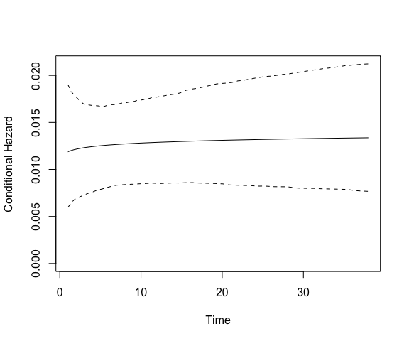

# spduration 

[](https://github.com/andybega/spduration/actions/workflows/R-CMD-check.yaml)
[](https://cran.r-project.org/package=spduration)
[](https://app.codecov.io/gh/andybega/spduration?branch=master)

spduration implements a split-population duration model for duration
data with time-varying covariates where a significant subset of the
population or spells will not experience failure.

``` r
library("spduration")
```

    ## Registered S3 method overwritten by 'quantmod':
    ##   method            from
    ##   as.zoo.data.frame zoo

``` r
# Prepare data
data(coups)
dur.coups <- add_duration(coups, "succ.coup", unitID="gwcode", tID="year",
                          freq="year")

# Estimate model
model.coups <- spdur(duration ~ polity2, atrisk ~ polity2, data = dur.coups,
                     silent = TRUE)
summary(model.coups)
```

    ## Call:
    ## spdur(duration = duration ~ polity2, atrisk = atrisk ~ polity2, 
    ##     data = dur.coups, silent = TRUE)
    ## 
    ## Duration equation: 
    ##             Estimate Std. Error t value Pr(>|t|)    
    ## (Intercept)  4.00150    0.23762  16.840  < 2e-16 ***
    ## polity2      0.20588    0.03037   6.779 1.21e-11 ***
    ## 
    ## Risk equation: 
    ##             Estimate Std. Error t value Pr(>|t|)  
    ## (Intercept)   6.5278     3.2556   2.005   0.0449 *
    ## polity2       0.8966     0.4084   2.196   0.0281 *
    ## 
    ##            Estimate Std. Error t value Pr(>|t|)
    ## log(alpha) -0.03204    0.11899  -0.269    0.788
    ## ---
    ## Signif. codes: *** = 0.001, ** = 0.01, * = 0.05, . = 0.1

``` r
plot(model.coups, type = "hazard")
```



## Install

- the latest released version from CRAN:

``` r
install.packages("spduration")
```

- the latest development version:

``` r
library(devtools)
install_github("andybega/spduration")
```

## Contact

- submit suggestions, bugs, issues, questions at:
  <https://github.com/andybega/spduration/issues>
- email: <adbeger+spduration@gmail.com>
